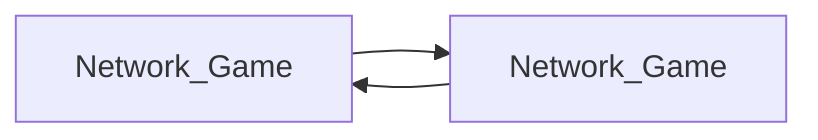
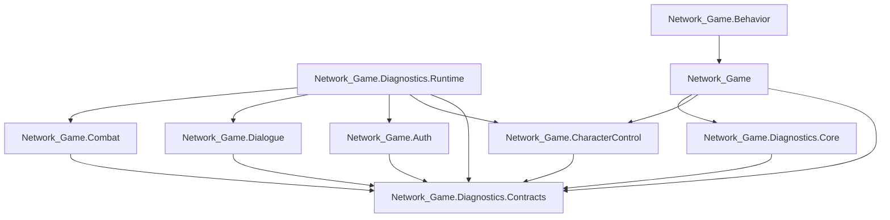

# Assembly Split Plan

## Goal

Introduce asmdefs that reduce accidental cross-subsystem coupling without forcing a risky full gameplay assembly breakup in one pass.

## Current State

Most gameplay code still compiles into one assembly:

- `Network_Game`

This means:

- all gameplay folders can reference each other directly
- compile scope is large
- diagnostics can reach deeply into feature code
- API drift shows up late because there is no assembly boundary between feature areas

## Safe Stage 1

Implemented now:

- `Network_Game.Diagnostics.Core`
- `Network_Game.Diagnostics.Contracts`
- `Network_Game.CharacterControl`
- `Network_Game.Combat`
- `Network_Game.Auth`

`Network_Game` now references the extracted assemblies above.

### Why these are safe

`Network_Game.Diagnostics.Core`

- contains `NGLog`, `TraceContext`, and `LogLevel`
- gives feature assemblies a stable logging dependency without referencing the gameplay monolith

`Network_Game.Diagnostics.Contracts`

- contains only DTOs/enums/snapshots
- has no project-internal dependencies
- is a stable bottom-layer assembly

`Network_Game.CharacterControl`

- contains the third-person controller, fly mode, and generated input types
- depends on Unity packages, not on `Network_Game`
- is already used as a feature island by dialogue and diagnostics

`Network_Game.Combat`

- depends only on Netcode and diagnostics core
- is used by dialogue and diagnostics, but does not depend back on gameplay feature assemblies

`Network_Game.Auth`

- now depends on a shared dialogue prompt-context bridge contract instead of directly referencing `NetworkDialogueService`
- depends on diagnostics core/contracts and Netcode, not on the gameplay monolith

## Why Full Diagnostics Was Not Split Yet

`Diagnostics` is not currently a leaf assembly.

Today it has this shape:

- gameplay systems depend on diagnostics for tracing, watchdogs, and runtime inspection
- tracing/builders inside `Diagnostics` depend back on `Auth`, `Dialogue`, `Combat`, and `CharacterControl`

If `Diagnostics` were split out right now while the rest of gameplay remained in `Network_Game`, we would create a circular dependency:

Unity asmdefs do not allow that.

## Why Full Dialogue Was Not Split Yet

`Dialogue` is close, but not independent yet.

Today parts of dialogue still depend on diagnostics runtime implementation details, not just diagnostics core/contracts:

- `NetworkDialogueService` references runtime brain/tracing helpers
- `DialogueMCPBridge` references runtime brain exports and scene projection builders

That means a direct `Network_Game.Dialogue` asmdef would still want to reference diagnostics runtime, while diagnostics runtime already depends back on dialogue-oriented scene semantics and live dialogue state.

Until that runtime dependency is inverted, `Dialogue` remains in `Network_Game`.

## Recommended Stage 2

Split diagnostics into two layers:

1. `Network_Game.Diagnostics.Core`
- `NGLog`
- low-level shared trace/log primitives
- no dependencies on gameplay feature assemblies

2. `Network_Game.Diagnostics.Runtime`
- authority builders
- scene projection builders
- brain runtime/session
- watchdogs that inspect feature assemblies

Then move feature-facing adapters behind subsystem-owned snapshots.

Example:

- `CharacterControl` exposes `PlayerControlRuntimeSnapshot`
- `Auth` exposes `AuthRuntimeSnapshot`
- `Dialogue` exposes `DialogueRuntimeSnapshot`

Diagnostics reads those snapshots instead of controller/service internals.

## Recommended Target Graph

## Practical Rule

Cross-assembly reads should prefer stable snapshots/contracts over direct feature object inspection.

Bad:

- diagnostics reads ad hoc controller/service members directly

Better:

- diagnostics reads `AuthoritySnapshot`, `DialogueInferenceEnvelope`, or subsystem-owned runtime snapshots

## Next Safe Splits

1. `Dialogue` contracts/helpers
2. move dialogue-facing diagnostics runtime hooks behind contracts/snapshots
3. `Dialogue`
4. `Diagnostics.Runtime`

That order reduces the chance of assembly cycles while making ownership boundaries explicit.
