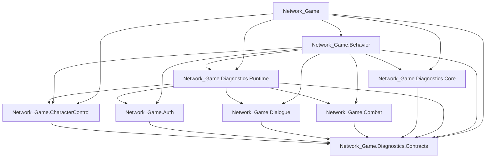

# Assembly Split Plan

## Goal

Introduce asmdefs that reduce accidental cross-subsystem coupling without forcing a risky full gameplay assembly breakup in one pass.

## Current State

Gameplay is now split into several first-pass assemblies, but `Network_Game` still exists as the catch-all assembly for uncategorized code and remaining cross-cutting runtime pieces.

This still means:

- some gameplay folders can still reference each other more freely than they should
- compile scope is still larger than the target state
- diagnostics still reaches into some feature internals instead of subsystem-owned snapshots
- API drift can still surface late where contracts have not been introduced yet

## Safe Stage 1

Implemented now:

- `Network_Game.Diagnostics.Core`
- `Network_Game.Diagnostics.Contracts`
- `Network_Game.Diagnostics.Runtime`
- `Network_Game.CharacterControl`
- `Network_Game.Combat`
- `Network_Game.Auth`
- `Network_Game.Dialogue`
- `Network_Game.Behavior`

`Network_Game` now references the extracted assemblies above.

### Why these are safe

`Network_Game.Diagnostics.Core`

- contains `NGLog`, `TraceContext`, and `LogLevel`
- gives feature assemblies a stable logging dependency without referencing the gameplay monolith

`Network_Game.Diagnostics.Contracts`

- contains only DTOs/enums/snapshots
- has no project-internal dependencies
- is a stable bottom-layer assembly

`Network_Game.CharacterControl`

- contains the third-person controller, fly mode, and generated input types
- depends on Unity packages, not on `Network_Game`
- is already used as a feature island by dialogue and diagnostics

`Network_Game.Combat`

- depends only on Netcode and diagnostics core
- is used by dialogue and diagnostics, but does not depend back on gameplay feature assemblies

`Network_Game.Auth`

- now depends on a shared dialogue prompt-context bridge contract instead of directly referencing `NetworkDialogueService`
- depends on diagnostics core/contracts and Netcode, not on the gameplay monolith

`Network_Game.Dialogue`

- now depends on diagnostics core/contracts instead of diagnostics runtime implementation types
- records inference envelopes and serves MCP-facing diagnostic exports through a diagnostics runtime bridge contract
- can compile independently from the gameplay monolith

`Network_Game.Diagnostics.Runtime`

 - now owns the runtime watchdogs, scene workflow tracking, tracing builders, and diagnostic brain runtime
 - depends on feature assemblies through contracts/bridges instead of the gameplay monolith
 - no longer depends on `Network_Game.Behavior`; bootstrap communication is routed through contracts

`Network_Game.Behavior`

- now owns scene bootstrap, network bootstrap, auth gate orchestration, player readiness, runtime binding, and camera/NPC setup
- depends on diagnostics runtime, dialogue, auth, combat, and character control through explicit asmdef references
- no longer depends on login UI or bootstrap consumers directly; those crossings are now routed through contracts

Example:

- `CharacterControl` exposes `PlayerControlRuntimeSnapshot`
- `Auth` exposes `AuthRuntimeSnapshot`
- `Dialogue` exposes `DialogueRuntimeSnapshot`

Diagnostics reads those snapshots instead of controller/service internals.

## Recommended Target Graph

## Practical Rule

Cross-assembly reads should prefer stable snapshots/contracts over direct feature object inspection.

Bad:

- diagnostics reads ad hoc controller/service members directly

Better:

- diagnostics reads `AuthoritySnapshot`, `DialogueInferenceEnvelope`, or subsystem-owned runtime snapshots

## Next Safe Splits

1. subsystem-owned runtime snapshots to reduce diagnostics reach-through
2. `Dialogue` internal sub-assembly cleanup if needed
3. UI behavior/performance tracing implementation

That order reduces the chance of assembly cycles while making ownership boundaries explicit.
