# DevProject Codebase Relationship Graph

Generated from Sourcebot MCP reference data — 2026-03-18.

## Full System Architecture

```mermaid
graph TB
  %% ─── Styling ──────────────────────────────────────────────
  classDef boot fill:#2d6a4f,stroke:#1b4332,color:#fff
  classDef dialogue fill:#1d3557,stroke:#0d1b2a,color:#fff
  classDef effects fill:#6a040f,stroke:#370617,color:#fff
  classDef mlagents fill:#7b2cbf,stroke:#3c096c,color:#fff
  classDef ui fill:#0077b6,stroke:#023e8a,color:#fff
  classDef diagnostics fill:#e36414,stroke:#9a031e,color:#fff
  classDef combat fill:#d00000,stroke:#6a040f,color:#fff
  classDef player fill:#606c38,stroke:#283618,color:#fff
  classDef auth fill:#bc6c25,stroke:#774936,color:#fff
  classDef data fill:#495057,stroke:#212529,color:#fff

  %% ─── BOOTSTRAP LAYER ─────────────────────────────────────
  subgraph Bootstrap ["🔌 Bootstrap Layer"]
    NB[NetworkBootstrap]:::boot
    BSB[BehaviorSceneBootstrap]:::boot
    PB[PlayerBootstrap]:::boot
    AB[AuthBootstrap]:::boot
    RB[RuntimeBinder]:::boot
  end

  %% ─── AUTH LAYER ───────────────────────────────────────────
  subgraph Auth ["🔑 Auth"]
    LPAS[LocalPlayerAuthService]:::auth
  end

  %% ─── DIALOGUE CORE ───────────────────────────────────────
  subgraph DialogueCore ["💬 Dialogue Pipeline"]
    NDS[NetworkDialogueService\n~9k LOC monolith]:::dialogue
    OAI[OpenAIChatClient]:::dialogue
    ACTOR[NpcDialogueActor]:::dialogue
    PROFILE[NpcDialogueProfile]:::data
  end

  %% ─── EFFECTS SUBSYSTEM ───────────────────────────────────
  subgraph Effects ["✨ Effects Pipeline"]
    DSEC[DialogueSceneEffectsController]:::effects
    ECAT[EffectCatalog]:::effects
    EPARSE[EffectParser]:::effects
    PPE[ParticleParameterExtractor]:::effects
    EDEF[EffectDefinition]:::effects
    ETRS[EffectTargetResolverService]:::effects
    EPROJ[DialogueEffectProjectile]:::effects
    EFBP[DialogueEffectFeedbackPrompt]:::effects
    ECOL[DialogueParticleCollisionDamage]:::effects
    ESAND[EffectSandboxRunner]:::effects
    EFBC[DialogueFeedbackCollector]:::effects
  end

  %% ─── ML-AGENTS ────────────────────────────────────────────
  subgraph MLAgents ["🧠 ML-Agents Training"]
    AGENT[NpcDialogueAgent]:::mlagents
    LLMCH[LlmDialogueChannel]:::mlagents
    SCDC[SideChannelDialogueClient]:::mlagents
    DAP[DialogueAgentProfile]:::mlagents
    GSP[GameStateProvider]:::mlagents
    ANIMA[NpcDialogueAnimationAgent]:::mlagents
  end

  %% ─── UI ───────────────────────────────────────────────────
  subgraph UI ["🖥️ UI Layer"]
    DCUI[DialogueClientUI]:::ui
    DDPAN[DialogueDebugPanel]:::ui
    MDC[ModernDialogueController]:::ui
    MHLM[ModernHudLayoutManager]:::ui
    MHM[ModernHudManager]:::ui
    PLC[PlayerLoginController]:::ui
    PPC[PlayerProfileController]:::ui
  end

  %% ─── DIAGNOSTICS ─────────────────────────────────────────
  subgraph Diagnostics ["🔍 Diagnostics"]
    DW[DebugWatchdog]:::diagnostics
    LDA[LlmDebugAssistant]:::diagnostics
    DFD[DialogueFlowDiagnostics]:::diagnostics
    SWD[SceneWorkflowDiagnostics]:::diagnostics
    DMCP[DialogueMCPBridge]:::diagnostics
  end

  %% ─── COMBAT ──────────────────────────────────────────────
  subgraph Combat ["⚔️ Combat"]
    CH[CombatHealth]:::combat
    CHR[CombatHealthRegistry]:::combat
    CRO[CombatRuntimeOverlay]:::combat
  end

  %% ─── PLAYER MOVEMENT ─────────────────────────────────────
  subgraph Player ["🏃 Player Movement"]
    TPC[ThirdPersonController]:::player
    FMC[FlyModeController]:::player
    SCM[SceneCameraManager]:::player
  end

  %% ═══════════════════════════════════════════════════════════
  %% EDGES — "A --> B" means A references/depends on B
  %% ═══════════════════════════════════════════════════════════

  %% Bootstrap wiring
  BSB --> NB
  BSB --> PB
  BSB --> DFD
  AB --> NB
  AB --> LPAS
  PB --> NB
  PB --> TPC
  RB --> NB
  RB --> ACTOR
  RB --> CH

  %% Auth dependencies
  LPAS --> NDS

  %% Dialogue core wiring
  NDS --> OAI
  NDS --> ACTOR
  NDS --> PROFILE
  NDS --> DSEC
  NDS --> ECAT
  NDS --> PPE

  %% Effects internal
  DSEC --> ECAT
  DSEC --> ACTOR
  DSEC --> PROFILE
  EPARSE --> ECAT
  EDEF --> PROFILE
  ETRS --> ACTOR
  ETRS --> CH
  EFBP --> DSEC
  EFBP --> TPC
  EPROJ --> CH
  EPROJ --> TPC
  ECOL --> CH
  ESAND --> DSEC
  ESAND --> ECAT
  EFBC --> ACTOR
  EFBC --> PROFILE

  %% ML-Agents wiring
  AGENT --> NDS
  AGENT --> LLMCH
  AGENT --> BSB
  SCDC --> OAI
  SCDC --> LLMCH
  GSP --> AGENT
  DAP --> AGENT
  ANIMA --> AGENT

  %% UI dependencies
  DCUI --> NDS
  DCUI --> LPAS
  DCUI --> TPC
  DDPAN --> NDS
  MDC --> LPAS
  MDC --> ACTOR
  MDC --> TPC
  MHLM --> LPAS
  MHM --> TPC
  PLC --> NB
  PLC --> LPAS
  PLC --> TPC
  PPC --> LPAS

  %% Diagnostics dependencies
  DW --> NDS
  DW --> LPAS
  DW --> TPC
  LDA --> NDS
  DFD --> NDS
  SWD --> NB
  SWD --> LPAS
  DMCP --> NDS
  DMCP --> DSEC
  DMCP --> LPAS
  DMCP --> ACTOR
  DMCP --> PROFILE
  DMCP --> ECAT

  %% Combat internal
  CHR --> CH
  CRO --> CH
  CRO --> DSEC

  %% Player internal
  FMC --> TPC
  SCM --> BSB
  SCM --> TPC
```



## Dialogue Pipeline Focus

```mermaid
graph LR
  classDef core fill:#1d3557,stroke:#0d1b2a,color:#fff
  classDef fx fill:#6a040f,stroke:#370617,color:#fff
  classDef consumer fill:#0077b6,stroke:#023e8a,color:#fff

  NDS[NetworkDialogueService]:::core
  OAI[OpenAIChatClient]:::core
  ACTOR[NpcDialogueActor]:::core
  PROF[NpcDialogueProfile]:::core

  DSEC[DialogueSceneEffectsController]:::fx
  ECAT[EffectCatalog]:::fx
  PPE[ParticleParameterExtractor]:::fx
  EP[EffectParser]:::fx

  DCUI[DialogueClientUI]:::consumer
  DDPAN[DialogueDebugPanel]:::consumer
  DMCP[DialogueMCPBridge]:::consumer
  DW[DebugWatchdog]:::consumer
  DFD[DialogueFlowDiagnostics]:::consumer
  LDA[LlmDebugAssistant]:::consumer
  AGENT[NpcDialogueAgent]:::consumer
  AUTH[LocalPlayerAuthService]:::consumer

  NDS --> OAI
  NDS --> ACTOR
  NDS --> PROF
  NDS --> DSEC
  NDS --> ECAT
  NDS --> PPE
  DSEC --> ECAT
  DSEC --> PROF
  DSEC --> ACTOR
  EP --> ECAT

  DCUI -.->|events| NDS
  DDPAN -.->|events| NDS
  DW -.->|events| NDS
  DFD -.->|events| NDS
  LDA -.->|async call| NDS
  AGENT -.->|training| NDS
  AUTH -.->|identity| NDS
  DMCP -.->|automation| NDS
  DMCP -.->|automation| DSEC
